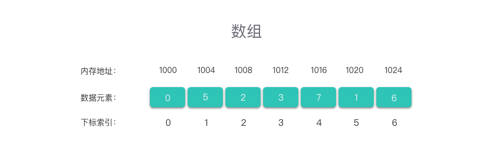
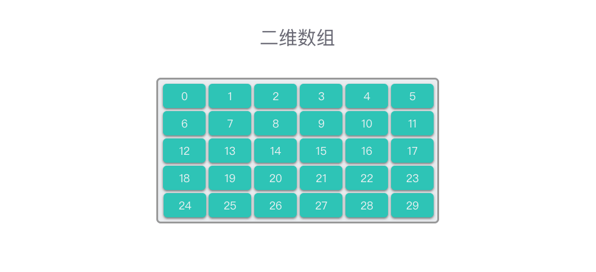
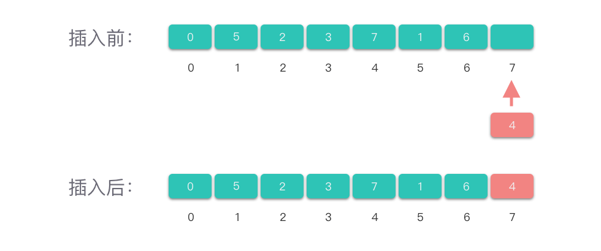
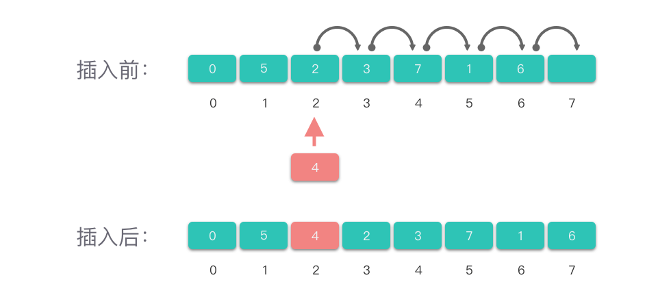

# 数组

## 介绍

### 定义

线性表结构，一组连续的内存空间，存储具有相同类型的数据

**实现线性表顺序存储结构的基础**



- 可以进行随机访问，根据首地址通过寻址公式计算出内存地址；

  - 下标 i 对应的数据元素地址 = 数据首地址 + i * 单个数据元素所占内存大小

- 多维数组

  

二维数组看做是一个矩阵，并处理矩阵的相关问题，比如转置矩阵、矩阵相加、矩阵相乘等等

### 基本操作

- 访问元素，复杂度O(1)
- 查找元素，数组无序的情况下，只能线性查找，复杂度O(n)
- 插入元素，尾插O(1)，指定I插入O(n)





- 修改元素，复杂度O(1)
- 删除元素，尾删，复杂度O(1)，指定位置删除O(n)，条件删除O(n)

## 排序

### 冒泡

#### 思想

> 第 `i (i = 1，2，… )` 趟排序时从序列中前 `n - i + 1` 个元素的第 `1` 个元素开始，相邻两个元素进行比较，若前者大于后者，两者交换位置，否则不交换


#### 分析

- 最好情况，数组有序，经过n-1次比较，复杂度O(n)
- 最差情况，数组逆序，n-1次排序，复杂度O(n^2)
- 冒泡排序在排序算法中需要移动较多次数的元素

#### 代码实现

```python
#!/usr/bin/env python
# -*- coding: utf-8 -*-

def bubbleSort(old_list):
    length = len(old_list)
    # n - 1轮排序
    for i in range(length-1):
        # n - i -1 次比较
        for j in range(length - i - 1):
            if old_list[j] > old_list[j+1]:
                old_list[j], old_list[j+1] = old_list[j+1], old_list[j]


if "__main__" == __name__:
    arr = [100, 44, 88, 92, 40, 1, 4, 2, 99, 67, 14, 1004, 888, 444, 666]
    print(arr)
    bubbleSort(arr)
    print(arr)
```

